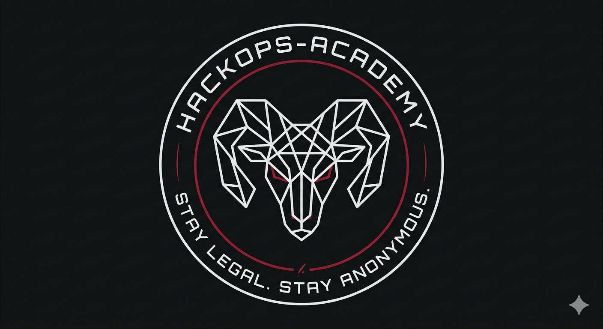
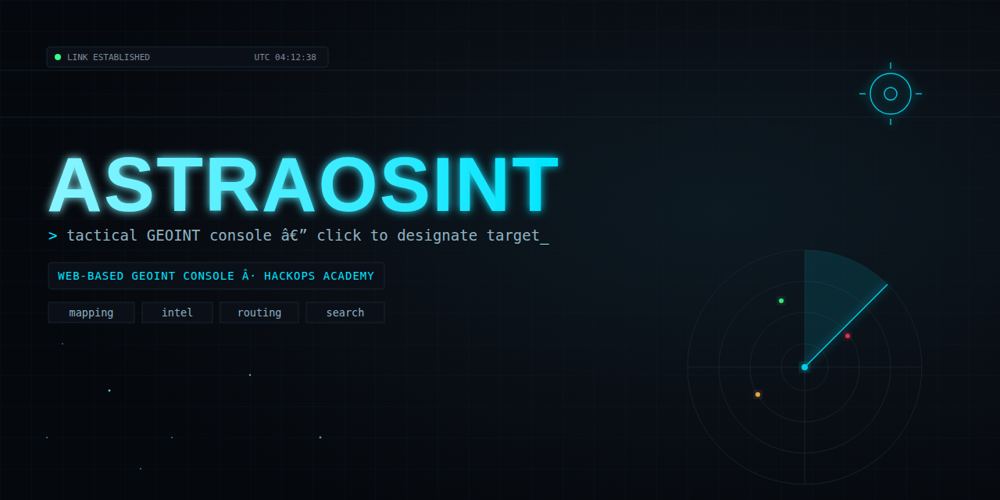
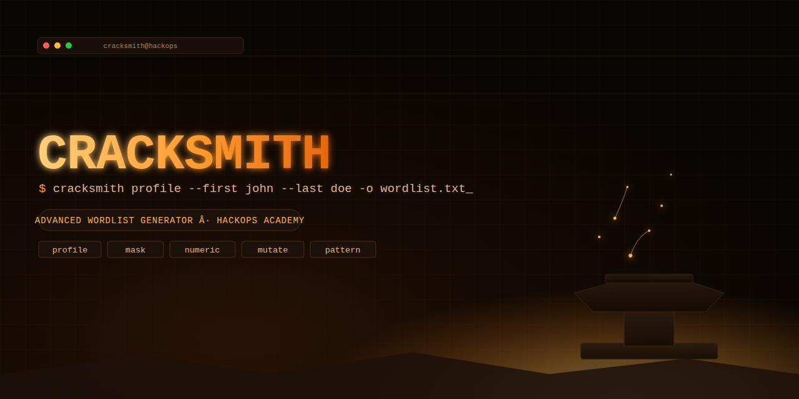
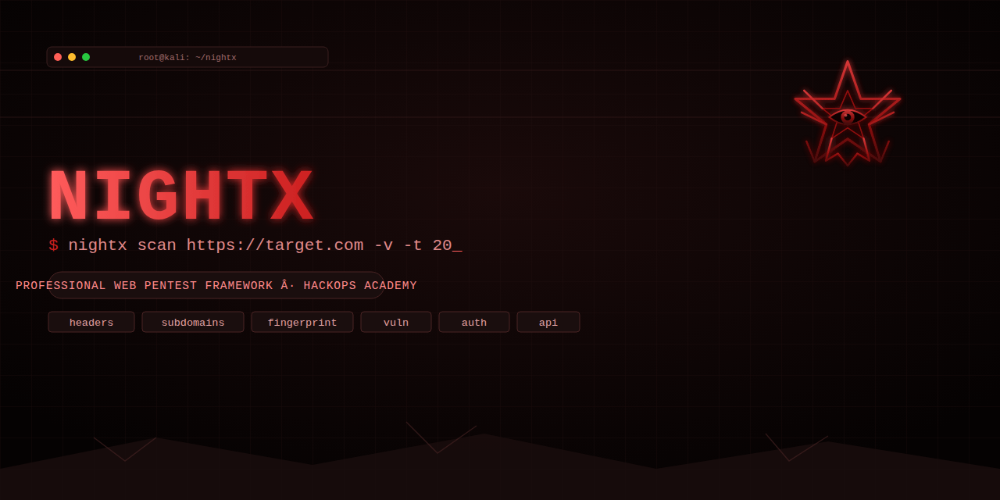
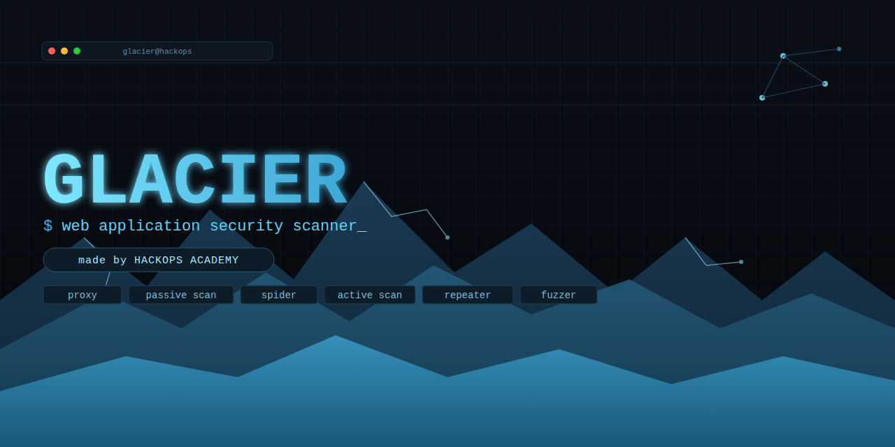

 

---

### 👨‍💻 About Me
> **"Stay legal. Stay anonymous."**

I am an **Offensive Security Specialist** and **Penetration Tester** with a passion for uncovering vulnerabilities and securing digital infrastructures. Through **HackOps Academy**, I bridge the gap between theory and practice by building open-source security tools and creating actionable educational content.

* 🔭 **Currently Focus:** Developing advanced offensive security modules and automating recon workflows.
* 🛡️ **Mission:** To democratize security knowledge and help teams fortify their posture against modern threats.

---

### 🛠️ Arsenal & Tech Stack

**Languages**

**Security Tools**

**Platforms & OS**

---

### 🏗️ Key Projects

---

  

